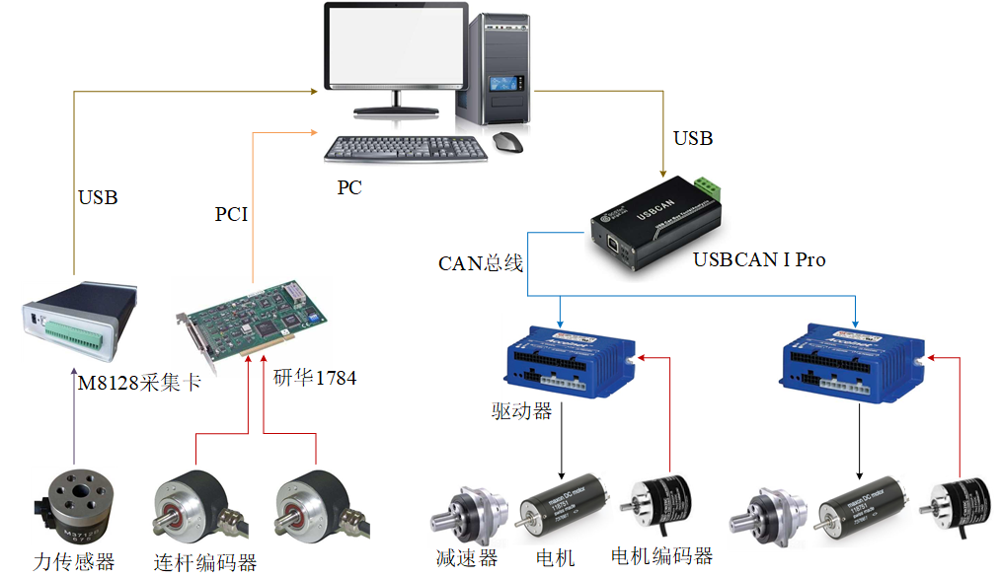
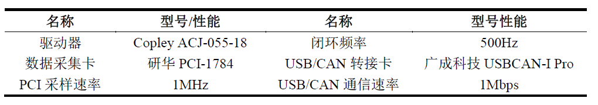

# DentalTouch_2DOF
The control program of a 2-DOF haptic device based on co-actuation principle.

The project realizes tracking motion in free space and virtual wall simulating in constrained space.

The control system and types of hardwares:

This project be reorganized to a more understandable verion. 
Please refer to the DentalTouch_2DOF/OneDOF/OneDOFDlg.cpp to see the main implementing process.
